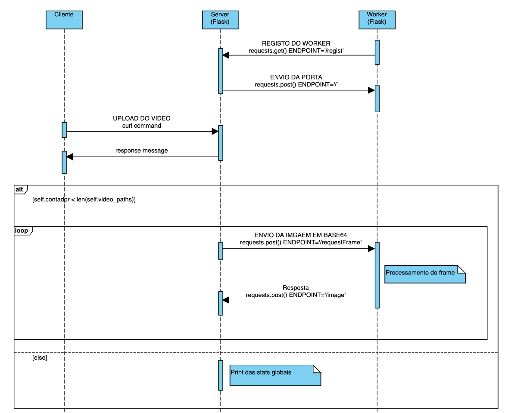

# SecondCDProject

**Distributed application** capable of **detecting** people in recorded video, showing if in the video there is at any time a number of people greater than a pre-configured value.

## Course
This project was developed under the [Distributed Computing](https://www.ua.pt/en/uc/12273) course of [University of Aveiro](https://www.ua.pt/).

## Technologies
Both the **server** and the **workers** use **Flask**, a **micro web framework** written in **Python**.


## Libraries
The following libraries were used in the development of the project:
* **TensorFlow** (code provided by the professor)
* **Keras** (code provided by the professor)
* **YOLOv3** (code provided by the professor)
* **Python Requests**
* **Python Asyncio**

## Protocol
**Protocol's message sequence chart**:
<p align="center">
    
</p>

## Install
```
$ python3 -m venv venv
$ source venv/bin/activate
$ python -m pip install --upgrade pip
$ pip install -r requirements.txt
$ wget https://pjreddie.com/media/files/yolov3.weights
```
 
## Examples
```
$ python3 object_detect.py kite.jpg
$ python3 video2image.py moliceiro.m4v
```

testing your server:
```
$ curl -F ‘video=@moliceiro.m4v’ http://localhost:5000
```

## How to run
Run **server.py**:
```
$ python3 server.py [--max MAX]
```
MAX - maximum number of persons in a frame (default = 10)

Run **worker.py** (run the following code as many times as the desired number of workers):
```
$ python3 worker.py
```

Finally, **send** the video to the server:
```
$ curl -F ‘video=@moliceiro.m4v’ http://localhost:5000
```

## Authors
* **Eduardo Santos**: [eduardosantoshf](https://github.com/eduardosantoshf)
* **Pedro Bastos**: [bastos-01](https://github.com/bastos-01)